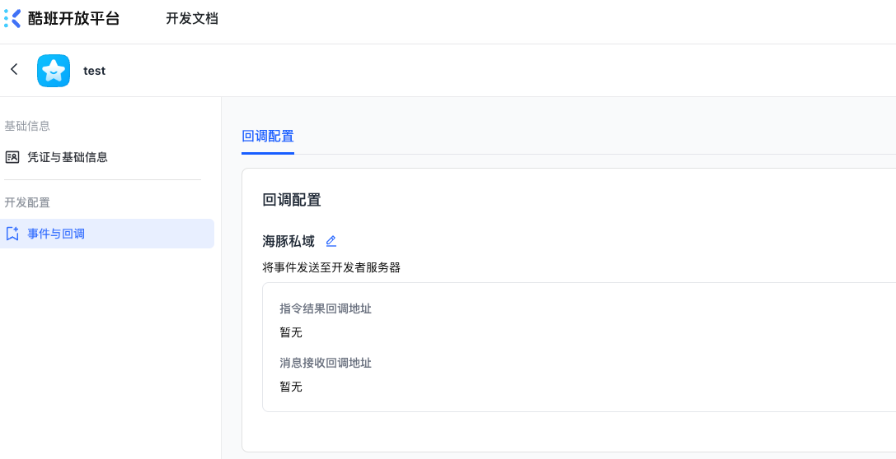

## 酷班开放平台的golang版本的sdk

厦门酷班科技开放平台的sdk，利用旗下产品开放出来的能力开发微信公众号，企业微信

### 平台入口
[酷班开放平台](https://open.cpshelp.cn)

### 文档
[酷班开放平台文档](https://open.cpshelp.cn/server-docs/api-call-guide/calling-process/overview)

## 快速开始
```
import "github.com/dcsunny/kbopen"
```

## 海豚私域例子

1. 先去酷班开放平台申请账号
2. 创建应用获取appid和secret
3. 授权海豚私域账号的权限

### 获取账号信息
```
package main

import (
	"fmt"
	"log"

	"github.com/dcsunny/kbopen/conf"
	"github.com/dcsunny/kbopen/htsy"
)

func main() {
	cfg := &conf.Config{
		Appid:            "",
		AppSecret:        "",
		AuthorizerUserId: "",
	}
	client := htsy.NewClient(cfg)
	r, err := client.Account().Info()
	if err != nil {
		log.Fatal(err)
		return
	}
	fmt.Println(client.Ctx.HttpClient.HttpLastResult)
	fmt.Println(r)
}
```

### 获取微号发送的消息
需要再应用配置回调地址



```
package main

import (
	"fmt"
	"net/http"

	"github.com/dcsunny/kbopen/conf"
	"github.com/dcsunny/kbopen/htsy"
	"github.com/dcsunny/kbopen/htsy/callback"
)

func callbackFunc(w http.ResponseWriter, r *http.Request) {
	cfg := &conf.Config{
		Appid:            "",
		AppSecret:        "",
		AuthorizerUserId: "",
	}
	client := htsy.NewClient(cfg)
	c := client.CallbackByHttp(r, w)
	c.SetHandler(func(msg *callback.Message) {
		fmt.Println(msg.Type)
	})
	c.Serve()
}

func main() {
	http.HandleFunc("/callback", callbackFunc)

	fmt.Println("Server is listening on port 8080...")
	err := http.ListenAndServe(":8080", nil)
	if err != nil {
		panic(err)
	}
}

```
